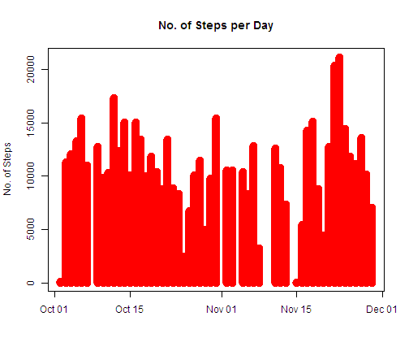
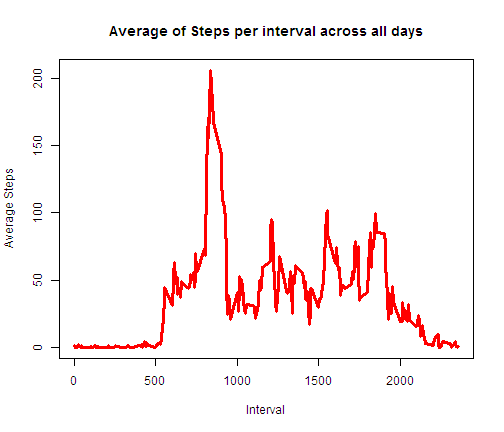
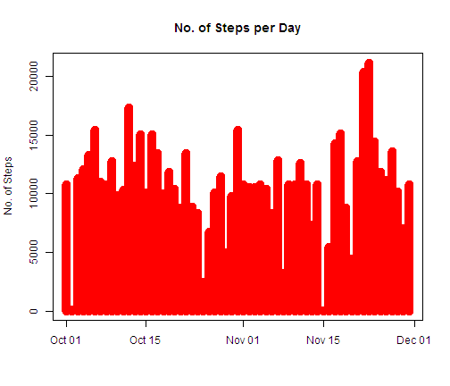
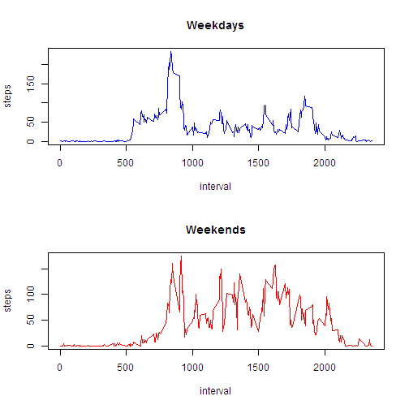

REPRODUCIBLE RESEARCH PROJECT 1
========================================================
<h2>1.Loading and Processing Data</h2>

```r
data <- read.csv("C:/activity.csv")
str(data)
```

```
## 'data.frame':	17568 obs. of  3 variables:
##  $ steps   : int  NA NA NA NA NA NA NA NA NA NA ...
##  $ date    : Factor w/ 61 levels "2012-10-01","2012-10-02",..: 1 1 1 1 1 1 1 1 1 1 ...
##  $ interval: int  0 5 10 15 20 25 30 35 40 45 ...
```


<h2>2.1 We first check the data without the rows with NA.</h2>

```r
clean <- na.omit(data)
str(clean)
```

```
## 'data.frame':	15264 obs. of  3 variables:
##  $ steps   : int  0 0 0 0 0 0 0 0 0 0 ...
##  $ date    : Factor w/ 61 levels "2012-10-01","2012-10-02",..: 2 2 2 2 2 2 2 2 2 2 ...
##  $ interval: int  0 5 10 15 20 25 30 35 40 45 ...
##  - attr(*, "na.action")=Class 'omit'  Named int [1:2304] 1 2 3 4 5 6 7 8 9 10 ...
##   .. ..- attr(*, "names")= chr [1:2304] "1" "2" "3" "4" ...
```


```r
head(clean, 20)
```

```
##     steps       date interval
## 289     0 2012-10-02        0
## 290     0 2012-10-02        5
## 291     0 2012-10-02       10
## 292     0 2012-10-02       15
## 293     0 2012-10-02       20
## 294     0 2012-10-02       25
## 295     0 2012-10-02       30
## 296     0 2012-10-02       35
## 297     0 2012-10-02       40
## 298     0 2012-10-02       45
## 299     0 2012-10-02       50
## 300     0 2012-10-02       55
## 301     0 2012-10-02      100
## 302     0 2012-10-02      105
## 303     0 2012-10-02      110
## 304     0 2012-10-02      115
## 305     0 2012-10-02      120
## 306     0 2012-10-02      125
## 307     0 2012-10-02      130
## 308     0 2012-10-02      135
```


<h2>2.2 Summarize the data by Date</h2>

```r
library(reshape2)
melted <- melt(clean, id = c("date"), measures.vars = steps)
subjMelt <- dcast(melted, date ~ variable, sum)
subjMelt
```

```
##          date steps interval
## 1  2012-10-02   126   339120
## 2  2012-10-03 11352   339120
## 3  2012-10-04 12116   339120
## 4  2012-10-05 13294   339120
## 5  2012-10-06 15420   339120
## 6  2012-10-07 11015   339120
## 7  2012-10-09 12811   339120
## 8  2012-10-10  9900   339120
## 9  2012-10-11 10304   339120
## 10 2012-10-12 17382   339120
## 11 2012-10-13 12426   339120
## 12 2012-10-14 15098   339120
## 13 2012-10-15 10139   339120
## 14 2012-10-16 15084   339120
## 15 2012-10-17 13452   339120
## 16 2012-10-18 10056   339120
## 17 2012-10-19 11829   339120
## 18 2012-10-20 10395   339120
## 19 2012-10-21  8821   339120
## 20 2012-10-22 13460   339120
## 21 2012-10-23  8918   339120
## 22 2012-10-24  8355   339120
## 23 2012-10-25  2492   339120
## 24 2012-10-26  6778   339120
## 25 2012-10-27 10119   339120
## 26 2012-10-28 11458   339120
## 27 2012-10-29  5018   339120
## 28 2012-10-30  9819   339120
## 29 2012-10-31 15414   339120
## 30 2012-11-02 10600   339120
## 31 2012-11-03 10571   339120
## 32 2012-11-05 10439   339120
## 33 2012-11-06  8334   339120
## 34 2012-11-07 12883   339120
## 35 2012-11-08  3219   339120
## 36 2012-11-11 12608   339120
## 37 2012-11-12 10765   339120
## 38 2012-11-13  7336   339120
## 39 2012-11-15    41   339120
## 40 2012-11-16  5441   339120
## 41 2012-11-17 14339   339120
## 42 2012-11-18 15110   339120
## 43 2012-11-19  8841   339120
## 44 2012-11-20  4472   339120
## 45 2012-11-21 12787   339120
## 46 2012-11-22 20427   339120
## 47 2012-11-23 21194   339120
## 48 2012-11-24 14478   339120
## 49 2012-11-25 11834   339120
## 50 2012-11-26 11162   339120
## 51 2012-11-27 13646   339120
## 52 2012-11-28 10183   339120
## 53 2012-11-29  7047   339120
```


<h2>2.3 Create Histogram of the total number of steps taken each day</h2>

```r
plot(as.Date(subjMelt[, 1]), subjMelt[, 2], type = "h", lwd = 10, xlab = "", 
    ylab = "No. of Steps", main = "No. of Steps per Day", col = "red")
```

 


<h2>2.4 Calculate and report the mean and median total number of steps taken per day</h2>

```r
summary(subjMelt[, 2])
```

```
##    Min. 1st Qu.  Median    Mean 3rd Qu.    Max. 
##      41    8840   10800   10800   13300   21200
```


<h2>3.1 Make a time series plot (i.e. type = "l") of the 5-minute interval (x-axis) and the average number of steps taken, averaged across all days (y-axis)</h2>

```r

silver <- melt(clean, id = c("date", "interval"), measures.vars = steps)
gold <- dcast(silver, interval ~ variable, mean)
head(gold, 30)
```

```
##    interval   steps
## 1         0 1.71698
## 2         5 0.33962
## 3        10 0.13208
## 4        15 0.15094
## 5        20 0.07547
## 6        25 2.09434
## 7        30 0.52830
## 8        35 0.86792
## 9        40 0.00000
## 10       45 1.47170
## 11       50 0.30189
## 12       55 0.13208
## 13      100 0.32075
## 14      105 0.67925
## 15      110 0.15094
## 16      115 0.33962
## 17      120 0.00000
## 18      125 1.11321
## 19      130 1.83019
## 20      135 0.16981
## 21      140 0.16981
## 22      145 0.37736
## 23      150 0.26415
## 24      155 0.00000
## 25      200 0.00000
## 26      205 0.00000
## 27      210 1.13208
## 28      215 0.00000
## 29      220 0.00000
## 30      225 0.13208
```


**Plot**

```r
plot(gold[, 1], gold[, 2], type = "l", lwd = 3, xlab = "Interval", ylab = "Average Steps", 
    main = "Average of Steps per interval across all days", col = "red")
```

 


<h2>3.2 Which 5-minute interval, on average across all the days in the dataset, contains the maximum number of steps?</h2>

```r
subset(gold, gold[, 2] == max(gold[, 2]))
```

```
##     interval steps
## 104      835 206.2
```


<h2>4.1 Calculate and report the total number of missing values in the dataset 
Sum of rows with NA values</h2>

```r
sum(is.na(data$steps))
```

```
## [1] 2304
```


<h2>4.2 Devise a strategy for filling in all of the missing values in the dataset. The strategy does not need to be sophisticated. For example, you could use the mean/median for that day, or the mean for that 5-minute interval, etc.</h2>

 *We will consider the mean of the the average of Steps per Day. We will use this mean to fill in the missing values.*


```r
mean <- sum(subjMelt[, 2])/53
mean
```

```
## [1] 10766
```


<h2>4.3 Create a new dataset that is equal to the original dataset but with the missing data filled in.</h2>


```r

melted <- melt(data, id = c("date"), measures.vars = steps)
subjMelt <- dcast(melted, date ~ variable, sum)
subjMelt[is.na(subjMelt)] <- mean
head(subjMelt, 10)
```

```
##          date steps interval
## 1  2012-10-01 10766   339120
## 2  2012-10-02   126   339120
## 3  2012-10-03 11352   339120
## 4  2012-10-04 12116   339120
## 5  2012-10-05 13294   339120
## 6  2012-10-06 15420   339120
## 7  2012-10-07 11015   339120
## 8  2012-10-08 10766   339120
## 9  2012-10-09 12811   339120
## 10 2012-10-10  9900   339120
```


<h2>4.4 Make a histogram of the total number of steps taken each day and Calculate and report the mean and median total number of steps taken per day</h2>


```r
plot(as.Date(subjMelt[, 1]), subjMelt[, 2], type = "h", lwd = 10, xlab = "", 
    ylab = "No. of Steps", main = "No. of Steps per Day", col = "red")
```

 


*We take the summary of the No. of Steps per Day to see its mean and median*

```r
summary(subjMelt[, 2])
```

```
##    Min. 1st Qu.  Median    Mean 3rd Qu.    Max. 
##      41    9820   10800   10800   12800   21200
```

`
**Do these values differ from the estimates from the first part of the assignment? What is the impact of imputing missing data on the estimates of the total daily number of steps?**

*Ans: No, Mean and Median will remain the same since we replaced the NA values with the mean of the data without the NA values. However, the 1st and 3rd quantile of the data will be changed.*

<h2>5.1 Create a new factor variable in the dataset with two levels - "weekday" and "weekend" indicating whether a given date is a weekday or weekend day.</h2>

```r
data <- read.csv("C:/activity.csv")
weeks <- as.factor(weekdays(as.Date(data[, 2])))
head(weeks, 20)
```

```
##  [1] Monday Monday Monday Monday Monday Monday Monday Monday Monday Monday
## [11] Monday Monday Monday Monday Monday Monday Monday Monday Monday Monday
## Levels: Friday Monday Saturday Sunday Thursday Tuesday Wednesday
```


```r
newdata <- cbind(weeks, data[, 1], data[, 3])
colnames(newdata) <- c("weekdays", "steps", "interval")
head(newdata)
```

```
##      weekdays steps interval
## [1,]        2    NA        0
## [2,]        2    NA        5
## [3,]        2    NA       10
## [4,]        2    NA       15
## [5,]        2    NA       20
## [6,]        2    NA       25
```


```r
low <- as.data.frame(newdata)
class(low)
```

```
## [1] "data.frame"
```

```r
head(low)
```

```
##   weekdays steps interval
## 1        2    NA        0
## 2        2    NA        5
## 3        2    NA       10
## 4        2    NA       15
## 5        2    NA       20
## 6        2    NA       25
```


**Grouping Data (Weekadays & Weekends using factor variables)**

```r
week_days <- subset(low, weekdays != 3 & weekdays != 4)
week_ends <- subset(low, weekdays == 3 | weekdays == 4)
```


```r
clean1 <- na.omit(week_days)
clean2 <- na.omit(week_ends)
write.table(clean1, "weekdays.txt")
write.table(clean1, "weekends.txt")
names(clean1)
```

```
## [1] "weekdays" "steps"    "interval"
```

```r

```


**Weekdays Average**

```r

sil <- melt(clean1, id = c("interval", "weekdays"), measures.vars = clean1$steps)
gol <- dcast(sil, interval ~ variable, sum)

sel <- as.numeric(gol$steps)/39
sel
```

```
##   [1]   2.3333   0.4615   0.1795   0.2051   0.1026   1.5128   0.7179
##   [8]   1.1795   0.0000   1.8462   0.4103   0.0000   0.4359   0.0000
##  [15]   0.2051   0.4615   0.0000   1.5128   2.2821   0.0000   0.2308
##  [22]   0.2308   0.3590   0.0000   0.0000   0.0000   1.4359   0.0000
##  [29]   0.0000   0.1795   0.0000   0.3077   0.0000   0.0000   2.1026
##  [36]   1.2821   0.0000   0.0000   0.0000   0.0000   0.0000   0.8462
##  [43]   1.1795   0.5128   0.4103   0.1026   0.0000   0.0000   0.1282
##  [50]   1.2821   2.1795   0.0000   0.4615   0.0000   3.2564   0.1538
##  [57]   3.8205   0.8974   2.2308   0.6667   0.0000   2.1282   4.0769
##  [64]   2.1795   4.3590   2.6667   2.8462   8.2308  21.0769  24.4615
##  [71]  52.0256  58.0769  42.7949  66.9487  72.5897  79.2564  66.0769
##  [78]  62.0256  68.6410  49.3077  57.4615  56.5128  48.5385  62.1795
##  [85]  51.6410  51.8205  63.7949  71.6154  65.1282  60.3590  67.8462
##  [92]  55.8974  64.3333  85.5128  69.2564  68.1795  84.1538  72.5385
##  [99] 146.2564 185.7436 205.1026 187.9487 202.2051 234.1026 222.4359
## [106] 186.5897 192.4359 178.6410 171.3846 126.0513  91.6154  84.1026
## [113] 103.5128  91.9231  57.3333  34.4103  27.8718  41.1795  39.7692
## [120]  17.1026  37.4615  16.8718  38.5641  47.0769  29.0256  32.7436
## [127]  31.4103  22.2308  21.7949  25.5385  21.5641  21.9231  20.2051
## [134]  24.3846  10.2051  14.8462  23.5385  23.3077  32.6667  50.2308
## [141]  44.9487  48.4359  50.7436  55.6667  54.4615  70.5641  81.9231
## [148]  72.5897  46.4615  46.3077  63.8205  30.4872  21.2821  28.0256
## [155]  30.8974  54.9487  21.8718  23.5641  21.6923  11.7436  34.0000
## [162]  43.0769  30.0769  23.0256  22.9744  38.1282  22.2308  32.5641
## [169]  45.5641  37.6410  30.3590  44.4872  26.2564  29.7179  29.8974
## [176]  12.5128  10.6923  21.3590  41.5897  37.4359  31.0000  34.8974
## [183]  29.1026  30.8462  38.9231  35.7436  41.2051  48.7179  91.7436
## [190]  95.4359  92.6923  68.2051  44.5385  42.2821  53.8462  31.9744
## [197]  22.1795  24.8718  19.2308  19.2564  22.9744  29.9231  24.7692
## [204]  30.6923  20.0256  43.2051  31.6410  46.0513  58.1795  71.3590
## [211]  54.1795  66.7692  84.0769  59.7692  34.4615  37.6154  24.4872
## [218]  44.8718  66.0769  82.2308  61.7179  74.3333  79.4615  82.6154
## [225]  92.6923 117.9231 103.5641  91.3590  87.9744  77.1282  63.0513
## [232]  54.5385  38.1282  20.5385  29.3590  46.8974  30.0256  17.5128
## [239]  44.0513  26.3333  12.4359   3.4872   4.8974  11.1538   5.9231
## [246]   3.3333   7.0769   4.9744   7.3333  11.8462  25.0000  16.8718
## [253]  10.6667  19.1538  29.2821  18.8974  14.5641   8.0513  12.5128
## [260]  16.5385   6.8974   7.5641   8.2821   3.5641   1.5385   4.5385
## [267]   6.5385  11.5641   9.6154  11.1795  13.2564   3.0000   0.0000
## [274]   0.1538   1.9487   1.6154   3.5897   3.8718   0.0000   1.1282
## [281]   1.3077   1.9231   3.1026   1.8718   2.0769   0.2051   0.3077
## [288]   1.4615
```


**Weekends Average**

```r

si <- melt(clean2, id = c("interval", "weekdays"), measures.vars = clean2$steps)
go <- dcast(si, interval ~ variable, sum)

se <- as.numeric(go$steps)/14
se
```

```
##   [1]   0.0000   0.0000   0.0000   0.0000   0.0000   3.7143   0.0000
##   [8]   0.0000   0.0000   0.4286   0.0000   0.5000   0.0000   2.5714
##  [15]   0.0000   0.0000   0.0000   0.0000   0.5714   0.6429   0.0000
##  [22]   0.7857   0.0000   0.0000   0.0000   0.0000   0.2857   0.0000
##  [29]   0.0000   0.0000   0.0000   0.0000   0.0000   0.0000   0.0000
##  [36]   0.0000   0.0000   0.0000   0.0000   0.0000   0.7857   0.0000
##  [43]   2.8571   0.7857   0.7143   0.0000   0.0000   0.0000   4.1429
##  [50]   0.0000   3.6429   0.0000   0.0000   1.3571   6.5000   2.0714
##  [57]   2.5714   0.6429   5.5714   2.3571   0.0000   0.0000   0.0000
##  [64]   2.4286   0.4286   3.7857   0.0000   0.0000   1.9286   1.2857
##  [71]   4.4286   6.6429   0.0000   0.0000   1.3571  19.4286   5.0714
##  [78]   5.4286   6.2143  11.5714   6.5714   9.7857   6.2143  12.4286
##  [85]  22.0000  23.6429  13.5000   6.8571   7.5714  24.8571  21.7857
##  [92]  12.0714  18.6429  25.0714  26.0714  22.6429  43.3571  56.1429
##  [99]  82.5714  78.9286  76.5714  64.7143 107.9286 128.3571 122.0714
## [106] 160.0000 158.2143 134.6429  65.6429 118.4286 157.8571 175.0000
## [113] 104.2857 107.2143  90.9286  75.3571  16.2143  32.0000  21.6429
## [120]  32.0714  49.2143  55.1429  53.1429  68.2143  66.5000 101.0714
## [127]  80.1429  79.7143  70.6429  36.1429  34.9286  59.8571  62.4286
## [134]  44.4286  52.2857  55.3571  41.8571  35.2857  35.5714  49.2857
## [141]  33.9286  33.9286  32.9286  69.0000  90.0714 135.4286 130.8571
## [148] 149.0000 110.5714  60.9286  28.4286  37.7857  41.1429  64.7857
## [155]  84.5000 101.6429  99.3571  85.3571 103.3571 122.4286  80.3571
## [162]  93.6429  78.0714  31.0000  87.2857  96.5000 117.2143 139.5000
## [169]  84.1429  91.8571  80.4286  60.4286  61.1429  59.3571  75.1429
## [176]  69.2857  35.0000  39.2143  49.2857  61.4286  27.2857  39.3571
## [183]  53.2857  61.1429  65.5714  81.2143  67.4286 111.5714  58.2857
## [190] 107.6429 128.3571 127.8571 111.1429 125.0000 132.2143 150.0714
## [197] 153.6429 157.0000 112.5000  92.3571 105.0714  88.7143 105.9286
## [204]  79.8571 120.7143  92.7857 103.8571 103.5000 113.2143 100.0714
## [211] 110.0714  39.8571  50.0714  47.4286  35.6429  37.0000  85.7857
## [218]  94.6429  98.7143  93.9286  52.4286  49.5000  72.7857  50.9286
## [225]  64.8571  48.0000  39.2857  69.5714  76.2143  79.7857  44.0714
## [232]  50.0714  31.2857  21.2143  21.9286  20.8571  30.7143  47.9286
## [239]  50.1429  53.5714  39.6429  62.2857  59.5714  95.1429  85.0000
## [246]  70.8571  83.6429  66.9286  53.5714  47.7143  52.6429  29.2857
## [253]  30.6429  11.8571   7.2143  20.2143   6.5714   7.9286  20.6429
## [260]  15.6429  13.6429   8.4286   7.7143   0.0000   1.2143   1.2857
## [267]   0.0000   0.0000   0.0000   1.7857   0.0000   0.0000   1.2143
## [274]   0.0000   0.6429  12.9286   2.5000   0.0000   0.0000   0.0000
## [281]   0.0000   0.6429   1.2143  12.5714   6.7143   1.8571   0.0000
## [288]   0.0000
```


**Plot**

```r
par(mfrow = c(2, 1))
plot(gol$interval, sel, type = "l", xlab = "interval", ylab = "steps", main = "Weekdays", 
    col = "blue")
plot(go$interval, se, type = "l", xlab = "interval", ylab = "steps", main = "Weekends", 
    col = "red")
```

 


<h3>The graph of Weekends is different from Weekdays.There are many high values in weekends graph compared to weekdays</h3>
